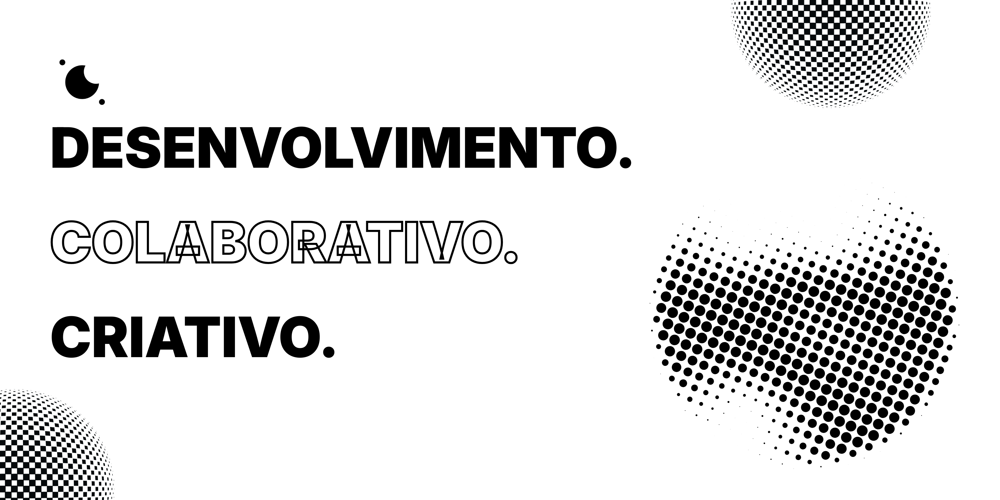

  

 

  
  
  

 

---

## Sobre a Synapse

A Synapse é uma empresa de tecnologia e criatividade focada em entregar soluções integradas em **Design**, **Desenvolvimento de Software** e **Vendas**. Trabalhamos com empresas e empreendedores para construir presença digital, desenvolver softwares sob medida e gerar oportunidades comerciais qualificadas.

---

## Serviços

### Design

<table>
  <tr>
    <td width="40">🎨</td>
    <td><strong>Design Gráfico</strong> — Identidade visual, layouts, logos e materiais gráficos que reforçam a imagem da marca do cliente.</td>
  </tr>
  <tr>
    <td>🎬</td>
    <td><strong>Edição de Vídeo</strong> — Produção e edição de vídeos profissionais para redes sociais, campanhas e conteúdo corporativo.</td>
  </tr>
  <tr>
    <td>📱</td>
    <td><strong>Social Media</strong> — Gestão de redes sociais integrada a estratégias de desenvolvimento digital, garantindo presença online consistente e engajamento real.</td>
  </tr>
</table>

---

### Desenvolvimento

<table>
  <tr>
    <td width="40">💻</td>
    <td><strong>Software sob Demanda</strong> — Desenvolvimento de soluções de software personalizadas para as necessidades específicas de empresas e empreendedores.</td>
  </tr>
  <tr>
    <td>☁️</td>
    <td><strong>Software como Serviço (SaaS)</strong> — Produtos digitais baseados em nuvem que oferecem soluções escaláveis e acessíveis em diversos segmentos.</td>
  </tr>
  <tr>
    <td>🔧</td>
    <td><strong>Suporte Técnico</strong> — Assistência técnica e manutenção para garantir o funcionamento contínuo dos sistemas e dispositivos dos clientes.</td>
  </tr>
</table>

---

### Vendas

<table>
  <tr>
    <td width="40">🤝</td>
    <td><strong>Equipe de Vendas Especializada</strong> — Um time focado na prospecção e captação de clientes para serviços de Design e Desenvolvimento, criando oportunidades de negócio qualificadas.</td>
  </tr>
</table>

---

## Roadmap

| Iniciativa | Status | Descrição |
|---|---|---|
| Impressão 3D | Planejado | Impressão 3D sob demanda para projetos de design, prototipagem e personalização. |
| Lojas de Produtos Próprios | Planejado | Venda de produtos físicos incluindo roupas, calçados, acessórios de informática e outros itens — com estoque próprio ou drop-shipping. |

---

## Tecnologias

  
  
  
  
  
  

---

  Synapse — Inovação em Design, Desenvolvimento e Vendas

